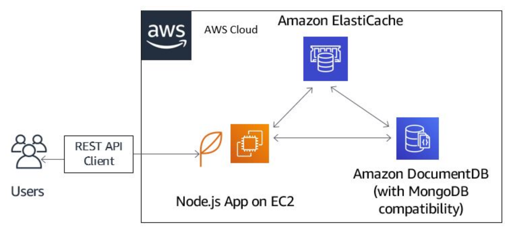

# Caching for performance with Amazon DocumentDB and Amazon ElastiCache

# Overview
In this demo, we showcase how to integrate [Amazon DocumentDB (with MongoDB compatibility)](https://aws.amazon.com/documentdb/) and [Amazon ElastiCache](http://aws.amazon.com/elasticache) to achieve microsecond response times. 

# Learning objectives
In this demo, you will learn the following:

- Create an Amazon DocumentDB cluster
- Create an Amazon ElastiCache cluster
- Install the MongoDB shell
- Connect to Amazon DocumentDB and Amazon ElastiCache clusters
- Improve the performance of a test app that uses Amazon DocumentDB and Amazon ElastiCache as backend.

The following diagram shows the architecture of the demo app.

# Architecture diagram

The demo application allows users to find their favorite song by submitting a song's title using a REST API client to the application engine. The application engine would then process the API request by retrieving the document containing the singer’s name and lyrics of the requested song from the backend. If there has been a prior request for that song already, the response is provided by Amazon ElastiCache thereby speeding up the response time. If not, the application engine would query Amazon DocumentDB to retrieve the requested document in JSON format.

In this demo, we use Amazon ElastiCache for Redis as the caching layer and a REST API client tool [Postman](https://www.getpostman.com/docs/) for testing our REST API requests.

# Create an EC2 instance

We will host the song application on an Amazon EC2 instance.

1. [Create EC2 key pair](https://awscli.amazonaws.com/v2/documentation/api/latest/reference/ec2/create-key-pair.html)

		aws ec2 create-key-pair --key-name demo-instance-key --query 'KeyMaterial' --output text > demo-instance-key.pem

2. [Create an EC2 instance](https://awscli.amazonaws.com/v2/documentation/api/latest/reference/opsworks/create-instance.html)

		aws ec2 run-instances --image-id ami-067f5c3d5a99edc80 --key-name demo-instance-key --instance-type t2.micro --region us-west-2 --subnet-id subnet-86d697e0 --count 1 

Verify that your instance has been launched successfully from the AWS console

# Create an Amazon DocumentDB cluster
First, we need to create a subnet group for our cluster using the following command:

	aws rds create-db-subnet-group --db-subnet-group-name my-subnet-group --db-subnet-group-description "test DB subnet group" --subnet-ids '["subnet-xxxxxx","subnet-xxxxxxx"]'

Next, let's create the cluster using the command below:

	aws docdb create-db-cluster --db-cluster-identifier demo-cluster --engine docdb --master-username xxxxxx --master-user-password xxxxxxx --db-subnet-group-name my-subnet-group

# Create Amazon ElastiCache cluster

	aws elasticache create-cache-cluster --cache-cluster-id "demo-cluster" --engine redis --cache-node-type cache.m5.large --num-cache-nodes 1

# Connect to the clusters

To connect to your Amazon DocumentDB and ElastiCache clusters from our EC2 intance, we need to update the security groups for the two clusters to allow inbound traffic for TCP ports 27017 and 6379, respectively.

Also enable inbound connections on the security group for the EC2 instance on TCP port 8082, which the demo application is listening on.

# Install the MongoDB shell

Next, install the MongoDB shell on the EC2 instance. Instructions for installing the MongoDB shell can be found on [YouTube](https://www.youtube.com/watch?v=qk98rR08szU) or in the [Getting Started guide](https://docs.aws.amazon.com/documentdb/latest/developerguide/getting-started.connect.html).
Verify the connection

Verify that you’re able to connect to the Amazon DocumentDB cluster from the EC2 instance, using the following command:

	mongo --ssl --host docdb-2019-06-16-22-03-10.cluster-c9di9qmu8xqw.us-east-1.docdb.amazonaws.com:27017 --sslCAFile rds-combined-ca-bundle.pem --username docdbadmin --password <###########>
	MongoDB shell version v3.6.13
	connecting to: mongodb://docdb-2019-06-16-22-03-10.cluster-c9di9qmu8xqw.us-east-1.docdb.amazonaws.com:27017/?gssapiServiceName=mongodb
	Implicit session: session { "id" : UUID("1fe7a152-8340-4d8e-b329-09c722b53b10") }
	MongoDB server version: 3.6.0
	rs0:PRIMARY>

Next, verify that you’re able to connect to the Amazon ElastiCache cluster. To do that, install the Redis command line interface (CLI) using the following steps on the same EC2 instance hosting the song application:

	sudo yum install gcc
	wget http://download.redis.io/redis-stable.tar.gz 
	tar xvzf redis-stable.tar.gz
	cd redis-stable
	make

To verify, connect to the ElastiCache for Redis cluster by running the following command:

	src/redis-cli -h myredis.obpmqw.ng.0001.use1.cache.amazonaws.com -p 6379

You should get the ElastiCache prompt below, confirming that you’re connected to the cluster.

	myredis.obpmqw.ng.0001.use1.cache.amazonaws.com:6379>

Now, run the following `keys *` command to see what is currently in your cache.

	myredis.obpmqw.ng.0001.use1.cache.amazonaws.com:6379> keys *
	(empty list or set)

The output confirms that the cache is empty.

# Build the demo app engine

Now that we can successfully connect to both the Amazon DocumentDB database and Amazon ElastiCache clusters, we can start building the Node.js app engine on an EC2 instance.

Use the same Node.js application running on the EC2 instance to populate the Amazon DocumentDB cluster with data containing singer, title, and text lyrics details.

First, ensure that Node.js is installed on the EC2 instance. Please check the following guide for [setting up Node.js on Amazon EC2 instance](https://docs.aws.amazon.com/sdk-for-javascript/v2/developer-guide/setting-up-node-on-ec2-instance.html)

After Node.js is installed on the EC2 instance, check that Node Package Manager (npm) is installed by running the following commands:

	       __|  __|_  )
	       _|  (     /   Amazon Linux 2 AMI
	      ___|\___|___|
	
	https://aws.amazon.com/amazon-linux-2/
	16 package(s) needed for security, out of 23 available
	Run "sudo yum update" to apply all updates.
	[ec2-user@ip-xx-xx-xx-xx ~]$ npm --version
	6.9.0
	[ec2-user@ip-xx-xx-xx-xx ~]$ which node
	~/.nvm/versions/node/v10.16.0/bin/node
	[ec2-user@ip-172-31-34-254 ~]$ 

## Create an application directory

Next, create a directory for the application and change to that directory using the commands below:

	mkdir cdstore
	cd cdstore

The following command generates the package.json file:

	npm init

You may select the default index.js value, but for main, enter cdstore.js instead of index.js.
Install dependencies

Next, install all the dependencies needed for the application to work. These include MongoDB driver that allows the application to connect to Amazon DocumentDB, a Node.js web application framework, a Node.js Redis client, and a body-parser that is Node.js body parsing middleware. Install them by running the following commands:

	npm install express --save
	npm install mongodb --save
	npm install redis –save
	npm install body-parser –save

The contents of the package.json file are as follows:

	{
	  "name": "cdstore",
	  "version": "1.0.0",
	  "description": "songs search engine app to showcase Amazon DocumentDB and Elasticache integration",
	  "main": "cdstore.js",
	  "scripts": {
	    "test": "echo \"Error: no test specified\" && exit 1"
	  },
	  "author": "GL",
	  "license": "ISC",
	  "dependencies": {
	    "body-parser": "^1.19.0",
	    "express": "^4.17.1",
	    "mongodb": "^3.2.7",
	    "mongoose": "^5.6.0",
	    "redis": "^2.8.0"
	  }
	}

## Creating the app functions

We need to create two app functions:

A SaveSong () function used for sending a /POST request to insert data into the Amazon DocumentDB instance. You could also write a script to insert data in bulk using the command db.<collection_name>.insert().

SearchSongByTitle() is used by the /GET method to perform the actual search.

Store the two functions in a file called cache.js. Create that file:

	touch cache.js
	
Use your favorite editor (vim, vi, etc.) and copy the code from the file code/cache.js and paste into your file and save.

## Create the endpoint

Now, create the endpoint cdstore.js as follows:

	touch cdstore.js

Copy the code from code/cdstore.js and paste into yours using your favorite editor.

## Start the application

Next, start the application, which, in this example, is set to run on port 8082 on the EC2 instance. To do that, use the following command:

	node cdstore.js

If everything is running correctly, you should see the following message on the console:

	Listening on port 8082

# Testing the application
Please following the instructions in this [blog post](https://aws.amazon.com/blogs/database/caching-for-performance-with-amazon-documentdb-and-amazon-elasticache/) for inserting test data into your Amazon DocumentDB cluster instance and making GET and POST requests to demonstrate the performance improvement related to the use of Amazon ElastiCache.

# Summary
In this demo, we demonstrated how to integrate Amazon DocumentDb with Amazon ElastiCache to improve performance. We used a demo custom app developed in Node.js which allows a user to send a request for their favorite song to a backend which can either be serviced from the caching layer by Amazon ElastiCache or from Amazon DocumentDb. On testing the application, the response time is substantially reduced.

# License

This library is licensed under the MIT-0 License. See the LICENSE file.

